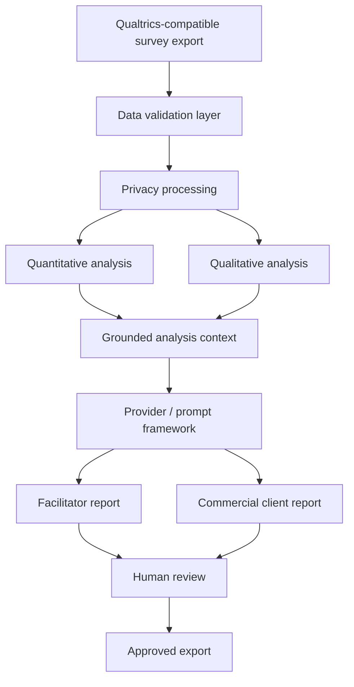
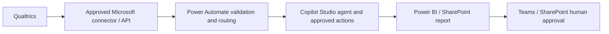

# Architecture

## Current prototype

The Streamlit app orchestrates pure Python modules. Validation never crashes on missing columns. Only masked text reaches analytics/reporting. Metrics and `Theme.evidence` form the analysis context; the deterministic provider converts only this context to prose. Raw personal data is not written to the audit log.

## Future Microsoft-aligned architecture

This is a proposed migration, not implemented integration.

