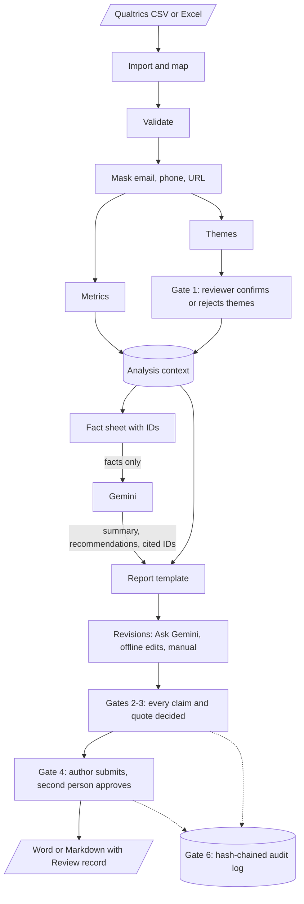
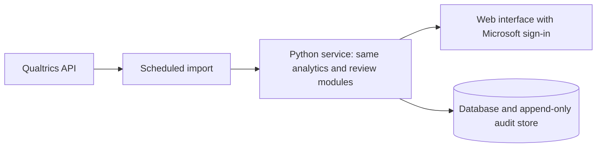

# Architecture

## Current application

A Python desktop app (Tkinter). Docker can serve the same window in a browser through noVNC. Everything runs on the user's computer except requests to Gemini.

Startup shows a sign-in screen before building the workspace. Local accounts are read from an editable UTF-8 `config/users.txt` file with readable plain-text passwords; the account file is reloaded on each login attempt. Accounts are maintained by an administrator, with no signup flow. Review names are still entered separately from the signed-in account.

```mermaid
flowchart TD
  F[/Qualtrics CSV or Excel/] --> L[Import and map]
  L --> V[Validate]
  V --> M[Mask email, phone, URL]
  M --> Q[Metrics]
  M --> T[Themes]
  Q --> C[(Analysis context)]
  T --> G1[Gate 1: reviewer confirms or rejects themes]
  G1 --> C
  C --> FS[Fact sheet with IDs]
  FS -->|facts only| AI[Gemini]
  AI -->|summary, recommendations, cited IDs| D[Report template]
  C --> D
  D --> R[Revisions: Ask Gemini, offline edits, manual]
  R --> G2[Gates 2-3: every claim and quote decided]
  G2 --> G4[Gate 4: author submits, second person approves]
  G4 --> X[/Word or Markdown with Review record/]
  G2 -.-> A[(Gate 6: hash-chained audit log)]
  G4 -.-> A
```

- Numbers are calculated in Python; Gemini only interprets ID-tagged facts and must cite IDs that exist.
- Gemini receives calculated facts, the user's question, and for "Ask Gemini" rewrites the masked text of the selected section. Raw comments, file names and course names are not sent.
- Without a Gemini key, drafts use local fixed wording.
- Gate 5 (review pace) is a warning shown in the panel and printed in the Review record.

See `code_map.md` for where each screen lives and `../README.md#human-review-workflow` for the gates.

## Possible production direction

```mermaid
flowchart LR
  Q[Qualtrics API] --> P[Scheduled import]
  P --> API[Python service: same analytics and review modules]
  API --> W[Web interface with Microsoft sign-in]
  API --> S[(Database and append-only audit store)]
```

This is a proposal, not implemented.
