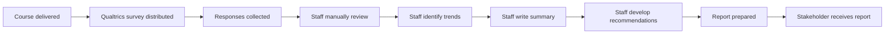

# AS-IS Process

Pain points include staff time, repetitive manual workload, variable structure/emphasis between reports, and difficulty scaling qualitative review. Ratings and comments must be combined into a coherent narrative for different audiences.

