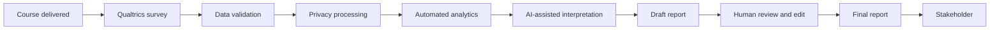

# TO-BE Process

```mermaid
flowchart LR
  A[Course delivered] --> B[Qualtrics survey]
  B --> C[Data validation]
  C --> D[Privacy processing]
  D --> E[Automated analytics]
  E --> F[AI-assisted interpretation]
  F --> G[Draft report]
  G --> H[Human review and edit]
  H --> I[Final report]
  I --> J[Stakeholder]
```

Automation accelerates evidence preparation and first drafting. Staff retain accountability for interpretation, recommendation suitability, privacy and release.

